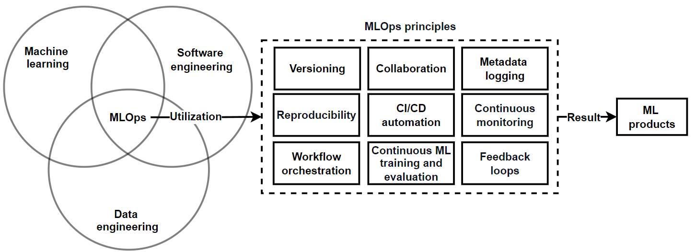
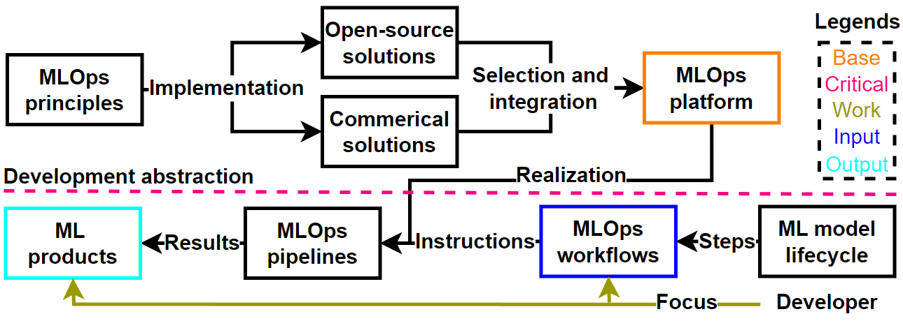

# Machine learning operations
 
## Used material

1.  [Machine Learning Operations (MLOps): Overview, Definition, and Architecture](https://arxiv.org/abs/2205.02302)

## Why use machine learning operations?

Machine learning operations (MLOps) is an intersection paradigm of machine learning (ML), software engineering, and data engineering that uses MLOps principles to create ML products [(1)](#used-material-1). See Figure 1 below. The MLOps principles are:

1. Versioning = Making code, data, and models reproducible and traceable

2. Reproducibility = The capability to reproduce an ML experiment and obtain the same results

3. Workflow orchestration = Coordination of tasks executed by ML pipelines using directed acyclic graphs (DAGs)

4. Collaboration = The ability to work cooperatively on the code, data, and models

5. CI/CD automation = Automation that handles building, testing, delivery, and deployment

6. Continuous ML training and evaluation = Periodic training and evaluation of models on new data 

7. Metadata logging = Automated tracking and logging of ML tasks, training, and evaluation

8. Continuous monitoring = Periodic assessment of code, data, model, infrastructure, and inference for error detection and improving quality

9. Feedback loops = Cyclical processes that maintain the product, such as model retraining, and develop the product, such as utilization of insights

These principles are implemented using open-source and commercial tools, enabling us to, through a use-case-based selection and integration, create MLOps platforms. MLOps platforms aim to provide a streamlined, customizable, and configurable development abstraction that serves as a unified user interface, enabling developers to focus on ML workflows and products by hiding system details. ML workflows form the activities and steps of an ML model lifecycle, such as data preparation, training, and deployment, that are realized with the MLOps platform to create ML pipelines that, through execution, create various ML products such as models, predictions, and metrics. See Figure 2 below.

## How to use machine learning operations?

The design and implementation of MLOps begins with the use case and user profile. Defining the use case helps us define the objectives we want to achieve, the constraints we must uphold, and the metrics we use for evaluation. Defining the user profile enables us to imagine the interests of the people who would benefit from the implemented MLOps. These together provide enough information for us to begin incremental design and implementation of MLOps systems. 

The use case we selected is the creation of a self-hosted open-source LLM that enables development assistance using this material. The user profile consists of individuals and small teams in academic or commerical start-ups that lack substantial local computing resources and have access to high-performance computing platforms for LLM development, who have at least basic knowledge in using remote infrastructures and at least basic MLOps knowledge, which they want to use to study their lacking areas in developing self-hosted LLMs via incremental adaption new methods for a mixture of private and public data. 

This material summarizes the necessary concepts, technologies, and steps to set up MLOps that enables the simultaneous use of local, cloud, and high-performance computing for developing self-hosted LLMs that assist in understanding and developing systems based on the provided material.  
 
---