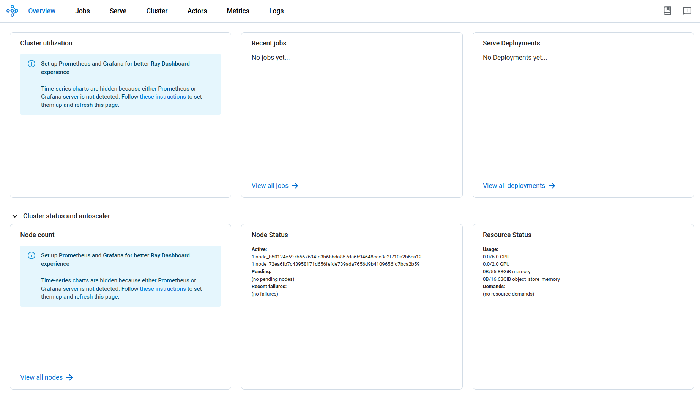
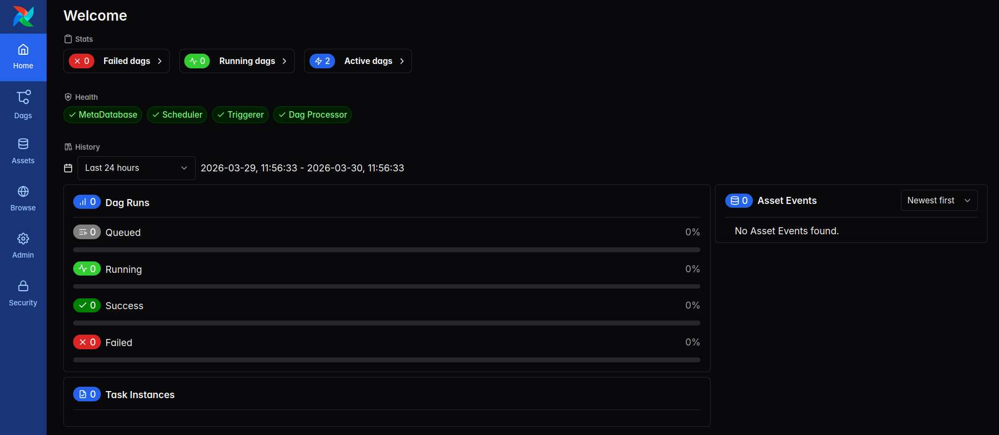

# Helm

## Used material

1. <span id="used-material-1"></span> [Helm docs](https://helm.sh/docs/)

2. <span id="used-material-2"></span> [RayCluster Quickstart](https://docs.ray.io/en/latest/cluster/kubernetes/getting-started/raycluster-quick-start.html#kuberay-raycluster-quickstart)

3. <span id="used-material-3"></span> [Helm Chart for Apache Airflow](https://airflow.apache.org/docs/helm-chart/stable/index.html)

4. <span id="used-material-4"></span> [Kuberay values.yaml](https://github.com/ray-project/kuberay/blob/master/helm-chart/kuberay-operator/values.yaml)

5. <span id="used-material-5"></span> [Airflow values.yaml](https://github.com/apache/airflow/blob/main/chart/values.yaml)

6. <span id="used-material-6"></span> [DockerHub rayproject/ray tags](https://hub.docker.com/r/rayproject/ray/tags)

7. <span id="used-material-7"></span> [Airflow external databases](https://github.com/airflow-helm/charts/blob/main/charts/airflow/docs/faq/database/external-database.md)

8. <span id="used-material-8"></span> [Airflow GitHub Issue Temporary fix to Bitnami psql chart licensing issues](https://github.com/apache/airflow/pull/55820)

9. <span id="used-material-9"></span> [Airflow GitHub Issue Remove postgres subcharts from Airflow Helm Charts](https://github.com/apache/airflow/issues/55823)

10. <span id="used-material-10"></span> [Airflow Github Issue Deployment fails with postgresql.enabled=true due to Bitnami image deprecation](https://github.com/apache/airflow/issues/56322)

11. <span id="used-material-11"></span> [Airlfow Extending the chart](https://airflow.apache.org/docs/helm-chart/stable/extending-the-chart.html)

12. <span id="used-material-12"></span> [Airflow Production guide](https://airflow.apache.org/docs/helm-chart/stable/production-guide.html)

13. <span id="used-material-13"></span> [Unable to Connect to External Postgres with Airflow Community Helm Chart](https://stackoverflow.com/questions/75606678/unable-to-connect-to-external-postgres-with-airflow-community-helm-chart)

14. <span id="used-material-14"></span> [Getting started with Airflow: Deploying your first pipeline on Kubernetes](https://medium.com/@rupertarup/getting-started-with-airflow-deploying-your-first-pipeline-on-kubernetes-0014495e6c92)

15. <span id="used-material-15"></span> [Kubernetes Executor](https://airflow.apache.org/docs/apache-airflow-providers-cncf-kubernetes/stable/kubernetes_executor.html)

16. <span id="used-material-16"></span> [Airflow with Git-Sync in Kubernetes](https://blog.devgenius.io/airflow-with-git-sync-in-kubernetes-0690460f67a5)

17. <span id="used-material-17"></span> [DockerHub apache/airflow tags](https://hub.docker.com/r/apache/airflow/tags?name=3.0.6)

## Why use Helm?

Helm is widely used for the following reasons:

- Most common tool for distributing Kubernetes applications (mature)

- Enables easy setup and configuration of complex container stacks (abstracted)

- Widely supported by different operating systems (interoperable)

These make Helm the default package manager, enabling us to create only small configuration files to use complex open-source tools that support Kubernetes. 

## How to use Helm?

Assuming we have a running OSS MLOps platform setup in the [OSS chapter](06_oss_mlops_platform.md), we can start using Helm by considering the application we want to run in OSS and how we want to configure it. We will again focus on relevant details of Helm, so see more details with [(1)](#used-material-1). In our case, we will use Helm to set up KubeRay [(2)](#used-material-2) and Apache Airflow [(4)](#used-material-4). For KubeRay, we have [CPU](helm/cpu-kuberay-values.yaml) and [GPU](helm/gpu-kuberay-values.yaml) value configurations created from [(4)](#used-material-4), with the difference being the assigned resources from the Nvshare setup in the [Kind chapter](./05_kind.md) and the GPU Docker image [(5)](#used-material-5). For airflow, we have [GitHub Sync and external Postgres](./helm/apache-airflow-values.yaml) value configuration created from these |[(5)](#used-material-5), [(6)](#used-material-6), [(7)](#used-material-7), [(8)](#used-material-8), [(9)](#used-material-9), [(10)](#used-material-10), [(11)](#used-material-11), [(12)](#used-material-12), [(13)](#used-material-13), [(14)](#used-material-14), [(15)](#used-material-15), [(16)](#used-material-16), [(17)](#used-material-17)|. We can deploy them with Helm in the following steps:

1. [Deploy KubeRay](./misc/kuberay-helm-print.txt)

```
cd multi-cloud-hpc-oss-mlops-platform/tutorials/integration/studying/parts/part-4/helm
helm repo add kuberay https://ray-project.github.io/kuberay-helm/
helm repo update
helm install kuberay-operator kuberay/kuberay-operator --version 1.0.0
helm install raycluster kuberay/ray-cluster --version 1.0.0 -f cpu/gpu-kuberay-values.yaml
```

2. Check the operator, head and worker pods

```
kubectl get pods -n default

NAME                                     READY   STATUS      RESTARTS           AGE
curl-pod                                 1/1     Running     1081 (3m25s ago)   129d
kuberay-operator-9986f78b7-97xc8         1/1     Running     0                  5m1s
nvshare-tf-matmul-1                      0/1     Completed   0                  11m
nvshare-tf-matmul-2                      0/1     Completed   0                  11m
raycluster-kuberay-head-k2g42            1/1     Running     0                  4m28s
raycluster-kuberay-worker-worker-rfv86   1/1     Running     0                  4m28s
```

3. Check [UI](http://localhost:8265)

```
ssh -L 8265:localhost:8265 GPU-cpouta
kubectl port-forward svc/raycluster-kuberay-head-svc 8265:8265 -n default
```



4. [Deploy Airflow](./misc/airflow-helm-print.txt)

```
cd multi-cloud-hpc-oss-mlops-platform/tutorials/integration/studying/parts/part-4/helm
helm repo add apache-airflow https://airflow.apache.org
helm upgrade --install airflow apache-airflow/airflow --namespace forwarder -f apache-airflow-values.yaml
```

5. Check Airflow pods

```
kubectl get pods -n forwarder

NAME                                       READY   STATUS    RESTARTS       AGE
airflow-api-server-9fd955f7c-4gqf4         1/1     Running   0              45m
airflow-dag-processor-d4bbcbf47-9xfxx      3/3     Running   0              45m
airflow-postgres-server-6c5547d769-rpng7   1/1     Running   17 (11d ago)   132d
airflow-redis-0                            1/1     Running   0              34m
airflow-scheduler-7c5d457cfd-ll8sz         2/2     Running   0              45m
airflow-statsd-66c7bc64f5-lvlgj            1/1     Running   0              45m
airflow-triggerer-0                        3/3     Running   0              44m
airflow-worker-0                           3/3     Running   2 (34m ago)    44m
celery-server-fb5b7569-7dzkt               1/1     Running   17 (11d ago)   136d
fastapi-server-5b7b7645f7-mdgd7            1/1     Running   17 (11d ago)   136d
flower-server-69b85c74fd-lbjr9             1/1     Running   18 (11d ago)   136d
redis-server-559776c84d-fdvt6              1/1     Running   17 (11d ago)   136d
```

6. Check [UI](http://localhost:8080/)

```
ssh -L 8080:localhost:8080 GPU-cpouta
kubectl port-forward svc/airflow-api-server 8080:8080 -n forwarder
```



If you have problems with KubeRay or Airflow, use these commands to check their pods to find the problem:

1. Check logs

```
kubectl logs (pod_name) -n default
```

2. Describe the pod

```
kubectl describe pods (pod_name) -n default
```

For KubeRay, the obvious problems are found from head worker [logs](./misc/ray-head-logs.txt) and its pod [describe](./misc/ray-head-describe.txt), with Airflow being the same for apiserver [logs](./misc/airflow-apiserver-logs.txt) and its pod [describe](./misc/airflow-apiserver-describe.txt). The most likely culprit is faulty values, which you can fix by rechecking [(4)](#used-material-4) for KubeRay and [(5)](#used-material-5) for Airflow. For GPU-related problems, check the [Kind chapter](./05_kind.md). In both cases, remove the cluster and reinstall with the following:

- Reinstall KubeRay

```
cd multi-cloud-hpc-oss-mlops-platform/tutorials/integration/studying/parts/part-4/helm
helm list -A
helm uninstall raycluster
helm uninstall kuberay-operator
helm install kuberay-operator kuberay/kuberay-operator --version 1.0.0
helm install raycluster kuberay/ray-cluster --version 1.0.0 -f cpu/gpu-kuberay-values.yaml
```

- Reinstall Airflow

```
cd multi-cloud-hpc-oss-mlops-platform/tutorials/integration/studying/parts/part-4/helm
helm list -A
helm delete airflow --namespace forwarder
helm upgrade --install airflow apache-airflow/airflow --namespace forwarder -f apache-airflow-values.yaml
```

---