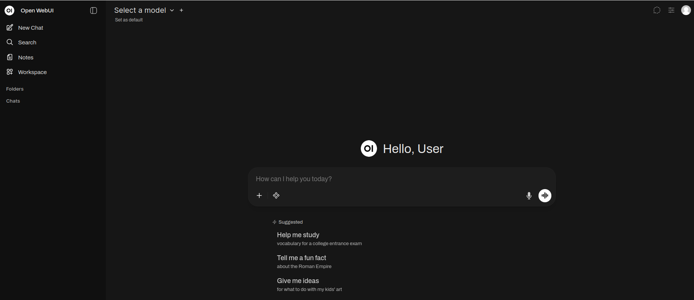

# Open WebUI

## Used material

1. <span id="used-material-1"></span> [Open WebUI](https://github.com/open-webui/open-webui)

2. <span id="used-material-2"></span> [Ollama GitHub](https://github.com/ollama/ollama)

3. <span id="used-material-3"></span> [Open WebUI Quick Start](https://docs.openwebui.com/getting-started/quick-start/)

4. <span id="used-material-4"></span> [Ollama docs](https://docs.ollama.com/api/introduction)

5. <span id="used-material-5"></span> [Docker Ollama: Run LLMs Locally for Privacy and Zero Cost](https://www.datacamp.com/tutorial/docker-ollama-run-llms-locally)

6. <span id="used-material-6"></span> [Ollama DockerHub](https://hub.docker.com/r/ollama/ollama)

7. <span id="used-material-7"></span> [Ollama models](https://ollama.com/search)

## Why use Open WebUI?

Open WebUI was chosen for the following reasons:

- One of the most used UI interfaces for LLMs (mature)

- Easy to setup and fit into LLM pipelines (abstracted)

- Usable in any place that supports Docker (interoperable)

These enable us to use Open WebUI as a customized interface that lets the user interact with an LLM running in local, cloud, or HPC environments.

## How to use Open WebUI?

Assuming we have a running OSS MLOps platform setup in the [OSS chapter](./06_oss_mlops_platform.md), we can use the commands of the [Kustomize chapter](./08_kustomize.md) to setup the provided [language deployment](./kustomize/language/kustomization.yaml) created with |[(1)](#used-material-1), [(2)](#used-material-2), [(3)](#used-material-3), [(4)](#used-material-4), [(5)](#used-material-5)|. It will deploy the Ollama backend and the Open WebUI front end to provide an easy-to-use inference platform for open-source LLMs. We can deploy them by running the following steps:

1. Deploy the stack with language folder

```
cd multi-cloud-hpc-oss-mlops-platform/tutorials/integration/studying/parts/part-4/kustomize
kubectl apply -k language
```

2. Confirm that both pods are running

```
kubectl get pods -n language
```

3. Check pod logs and describe:

```
kubectl get (pod_name) -n languages
kubectl describe pod -n languages
```

4. Compare them against given ones:

- Ollama [logs](./misc/ollama-logs.txt) and [describe](./misc/ollama-describe.txt)

- Open WebUI [logs](./misc/open-webui-logs.txt) and [describe](./misc/open-webui-describe.txt)

We can get access to them in the following way:

```
# Ollama
ssh -L 7100:localhost:7100 cpouta
kubectl port-forward svc/ollama-service 7100:7100 -n language

# Webui
ssh -L 7101:localhost:7101 cpouta
kubectl port-forward svc/webui-service 7101:7101 -n language
```

You can now open the [UI](http://localhost:7101/) and start using models with the following steps:



1. Click the top-right user button gear

2. Click the admin panel

3. Click settings

4. Click models

5. Write ‘mistral:7b’

6. Click pull model

7. After downloading the model, go to the new chat

8. Click the top left list to select the model

9. Write a prompt and press enter

Now, if you ask 'Can you explain Python shortly?' and wait around 10-20 seconds (you can see statistics by hovering on the 'i' symbol below the prompt), you might receive the following answer:

Python is a high-level, interpreted programming language that is widely used for various purposes such as web development, data analysis, machine learning, artificial intelligence, and more. It is known for its simplicity and readability due to its use of English keywords frequently wherever possible, and its clean syntax which allows developers to write clear, logical code for a wide range of applications. Python supports multiple programming paradigms, including procedural, object-oriented, and functional programming. Its large standard library, known as the "batteries included" philosophy, offers many high-level modules making it easy for programmers to use and learn. Additionally, Python's open-source nature and active community contribute to its popularity among developers.

We can use these short questions to roughly estimate the VRAM consumption of each model by using nvidia-smi command, which gives us the following:

```
+---------------------------------------------------------------------------------------+
| NVIDIA-SMI 535.288.01             Driver Version: 535.288.01   CUDA Version: 12.2     |
|-----------------------------------------+----------------------+----------------------+
| GPU  Name                 Persistence-M | Bus-Id        Disp.A | Volatile Uncorr. ECC |
| Fan  Temp   Perf          Pwr:Usage/Cap |         Memory-Usage | GPU-Util  Compute M. |
|                                         |                      |               MIG M. |
|=========================================+======================+======================|
|   0  Tesla P100-PCIE-16GB           Off | 00000000:00:06.0 Off |                    0 |
| N/A   23C    P0              34W / 250W |   5124MiB / 16384MiB |      0%      Default |
|                                         |                      |                  N/A |
+-----------------------------------------+----------------------+----------------------+
                                                                                         
+---------------------------------------------------------------------------------------+
| Processes:                                                                            |
|  GPU   GI   CI        PID   Type   Process name                            GPU Memory |
|        ID   ID                                                             Usage      |
|=======================================================================================|
|    0   N/A  N/A   2405649      C   /usr/bin/ollama                             386MiB |
+---------------------------------------------------------------------------------------+
```

This shows that generating the response took around 5.1 GB of VRAM. This will usually increase as the prompt and answer length increase, which can be difficult to predict, leading some models to fail because the token requirements exceed the available VRAM. In this case, we can generally expect models [(7)](#used-material-7) under 20B to be smaller, enabling longer questions and answers. Be aware that older Ollama was choosen due to the incompatabilities with Nvshare from newer versions.

---