# Istio

## Used material

1. <span id="used-material-1"></span> [Istio website](https://istio.io/)

2. <span id="used-material-2"></span> [Istio docs](https://istio.io/latest/docs/)

3. <span id="used-material-3"></span> [Gateway](https://istio.io/latest/docs/reference/config/networking/gateway/)

4. <span id="used-material-4"></span> [Virtual Service](https://istio.io/latest/docs/reference/config/networking/virtual-service/)

5. <span id="used-material-5"></span> [Ingress Gateways](https://istio.io/latest/docs/tasks/traffic-management/ingress/ingress-control/)

6. <span id="used-material-6"></span> [Kiali - The Console for Istio Service Mesh](https://kiali.io/)

7. <span id="used-material-7"></span> [Kiali Quick Start](https://kiali.io/docs/installation/quick-start/)

8. <span id="used-material-8"></span> [Kiali Prerequisites](https://kiali.io/docs/installation/installation-guide/prerequisites/)

9. <span id="used-material-9"></span> [The /etc/hosts file](https://tldp.org/LDP/solrhe/Securing-Optimizing-Linux-RH-Edition-v1.3/chap9sec95.html)

## Why use Istio? 

Istio was chosen for the following reasons:

- One of the most used service meshes for Kubernetes microservices (mature)

- Enables easy setup and configuration of cluster traffic management (abstracted)

- Widely supported in different Kubernetes clusters (interoperable)

These enable us to use Istio to forward requests from outside the kind cluster and observe network traffic.

## How to use Istio?

Assuming we setup the databases in the [Kustomize chapter](./08_kustomize.md) and optionally the LLM inference stack in the [Open WebUI chapter](./09_open_webui.md), we will use Istio [(1)](#used-material-1) to remove the need to manually port forward Kind cluster services. We will only show relevant details, so check [(2)](#used-material-2) for more. Forwarding Kind connections outside the cluster is done with the following steps |[(3)](#used-material-3), [(4)](#used-material-4), [(5)](#used-material-5), [(6)](#used-material-6), [(7)](#used-material-7), [(8)](#used-material-8), [(9)](#used-material-9)|:

1. Get the current configuration of Istiod

```
kubectl get deployment istiod -n istio-system -o yaml > study-istiod.yaml
```

2. Open the file

```
nano study-istiod.yaml
```

2. Modify the value of ENABLE_DEBUG_ON_HTTP to "true"

```
spec:
  template:
    spec:
      containers:
      - args:
        env:
        - name: ENABLE_DEBUG_ON_HTTP
          value: "true"
```

3. Save modification

```
CTRL + X 
Y
```

4. Apply modified configuration

```
kubectl apply -f study-istiod.yaml
```

5. Confirm istiod is running again

```
kubectl get pods -n istio-system
```

This should give the following print:

```
NAME                                     READY   STATUS    RESTARTS       AGE
cluster-local-gateway-687c8948c6-dfxdb   1/1     Running   18 (14d ago)   139d
istio-ingressgateway-66d47846bf-756nn    1/1     Running   18 (14d ago)   139d
istiod-7759f88b6b-rp5vn                  1/1     Running   17 (14d ago)   134d
```

6. Deploy Kiali to provide a dashboard for Istio 

```
cd multi-cloud-hpc-oss-mlops-platform/tutorials/integration/studying/parts/part-4/networking
kubectl apply -k kiali
```

7. Check Kiali [logs](./misc/kiali-logs.txt) and [describe](./misc/kiali-describe.txt)

```
kubectl logs kiali-(id) -n istio-system
kubectl describe pod kiali-(id) -n istio-system
```

8. Check current gateways and virtual services

```
kubectl get gateways -A
kubectl get virtualservices -A
```

These should give following prints:

```
# gateways
NAMESPACE         NAME                    AGE
istio-system      cluster-local-gateway   2d6h
istio-system      istio-ingressgateway    2d6h
knative-serving   knative-local-gateway   2d6h
kubeflow          kubeflow-gateway        2d6h

# virtualservices 
NAMESPACE   NAME     GATEWAYS                        HOSTS   AGE
mlflow      mlflow   ["kubeflow/kubeflow-gateway"]   ["*"]   2d6h
```

9. Get the current istio-ingressgateway configuration 

```
kubectl get svc istio-ingressgateway -n istio-system -o yaml > study-istio-ingressgateway.yaml
```

10. Open the file

```
nano study-istio-ingressgateway.yaml
```

11. Modify the [configuration](./networking/ingressgateway-modification.txt) by mapping the wanted ports to the extraPortMappings mentioned in the [Kind chapter](./05_kind.md)

12. Save modification

```
CTRL + X 
Y
```

13. Apply the modified configuration

```
kubectl apply -f study-istio-ingressgateway.yaml
```

14. Deploy gateways and virtual services for cluster HTTP and TCP connections

```
kubectl apply -k http
kubectl apply -k tcp
```

15. Confirm the addition of gateways and virtual services

```
kubectl get gateways -A
kubectl get virtualservices -A
```

Compare the prints against given [gateways](./networking/gateways.txt) and [virtualservices](./networking/virtualservices.txt)

16. Modify your computers /etc/hosts 

```
sudo nano /etc/hosts
```

It should have [hosts](./networking/etc-hosts.txt) lines

17. Save modification

```
CTRL + X 
Y
```

18. Modify your SSH config mentioned in the [SSH chapter](./01_ssh.md)

```
cd .ssh
nano config
```

It should have [localforward](./networking/ssh-config.txt) lines

19. Connect to your VM

```
ssh Host lf-cpouta
```

20. Try connecting with a browser to HTTP dashboards

- [Kubeflow UI](http://kubeflow.oss:7001)

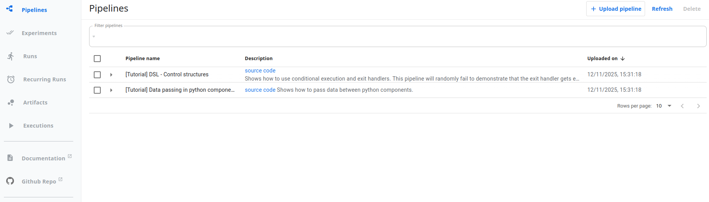

- [Kubeflow MinIO](http://kubeflow.minio.oss:7001)  (user is minio and password minio123)


- [MLflow UI](http://mlflow.oss:7001)


- [MLflow MinIO](http://mlflow.minio.oss:7001) (user and password is minioadmin)

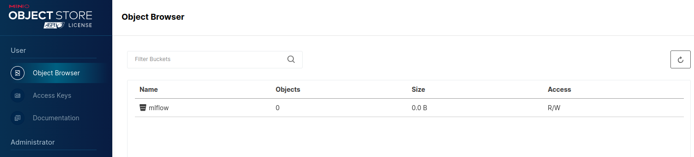

- [Prometheus](http://prometheus.oss:7001)

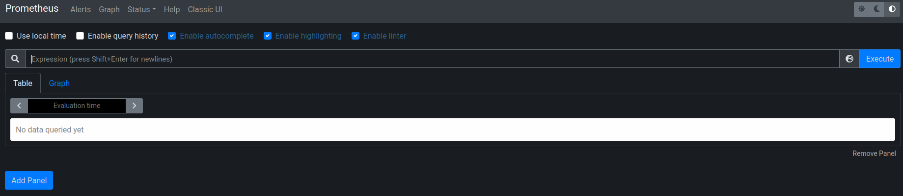

- [Grafana](http://grafana.oss:7001) (user and password is admin)

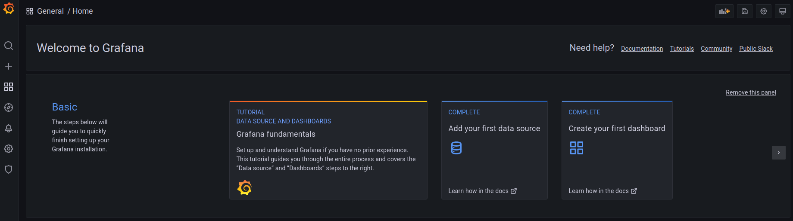

- [Forwarder Frontend](http://forwarder.frontend.oss:7001/docs)

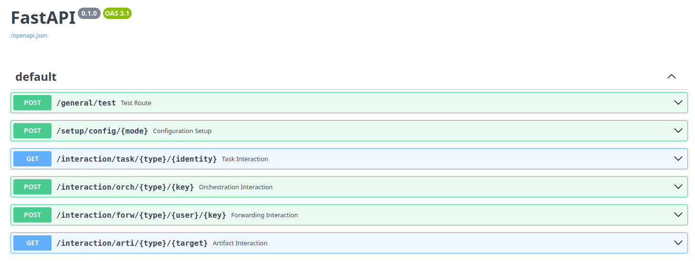

- [Forwarder Monitor](http://forwarder.monitor.oss:7001/) (user is flower123 and password flower456)

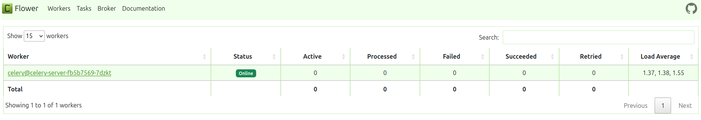

- [Forwarder Airflow](http://forwarder.airflow.oss:7001/) (user is admin and password admin)


- [Kiali](http://kiali.oss:7001)

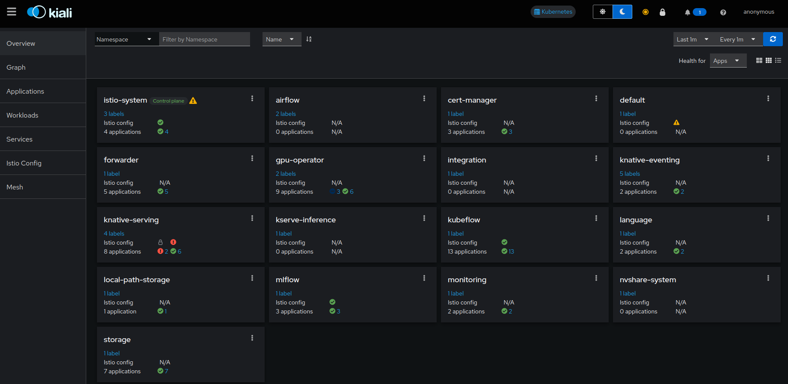

- [MinIO UI](http://minio.oss:7001) (user and password is minioadmin)

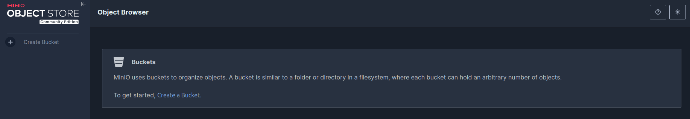

- [Mongo Express](http://mongo.oss:7001) (user is express123 and password express456)

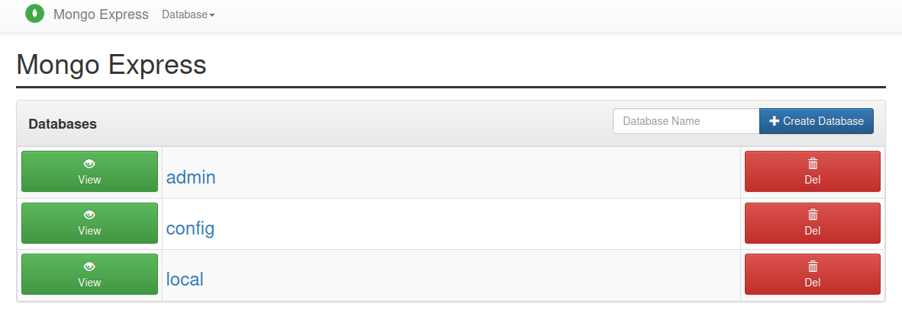

- [Qdrant UI](http://qdrant.oss:7001/dashboard) (apikey is qdrant_key)

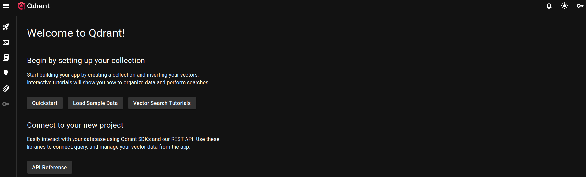

- [Neo4j UI](http://neo4j.oss:7001) (connect to localhost:7007 with neo4j/password)

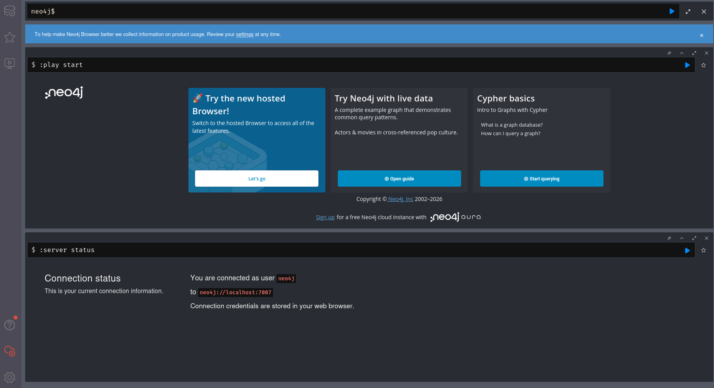

- [Open WebUI](http://webui.oss:7001)


- [OSS cloud Ray](http://ray.cloud.dash-1.oss:7001/)


21. Try connecting with curl to [HTTP dashboards](./networking/http-curls.txt)

22. Try connecting with curl to [TCP databases](./networking/tcp-curls.txt) as shown in the [Curl chapter](./10_curl.md)

23. Check Istio, ingressgateway and Kiali logs
 
```
kubectl logs istiod-(id) -n istio-system
kubectl logs istio-ingressgateway-(id) -n istio-system
kubectl logs kiali-(id) -n istio-system
```

24. Compare the results of each curl requests to the provided responses and Istio ingressgateway logs

- HTTP
    - Kubeflow UI
        - [Response](./networking/responses/kubeflow-ui-curl.txt)
        - [Logs](./networking/logs/kubeflow-ui-istio.txt)
    - Kubeflow MinIO
        - [Response](./networking/responses/kubeflow-minio-curl.txt)
        - [Logs](./networking/logs/kubeflow-minio-istio.txt)
    - MLflow UI
        - [Response](./networking/responses/mlflow-ui-curl.txt)
        - [Logs](./networking/logs/mlflow-ui-istio.txt)
    - MLflow MinIO UI
        - [Response](./networking/responses/mlflow-minio-ui-curl.txt)
        - [Logs](./networking/logs/mlflow-minio-ui-istio.txt)
    - Prometheus
        - [Response](./networking/responses/prometheus-curl.txt)
        - [Logs](./networking/logs/prometheus-istio.txt)
    - Grafana
        - [Response](./networking/responses/grafana-curl.txt)
        - [Logs](./networking/logs/grafana-istio.txt)
    - Forwarder Frontend
        - [Response](./networking/responses/forwarder-frontend-curl.txt)
        - [Logs](./networking/logs/forwarder-frontend-istio.txt)
    - Forwarder Monitor
        - [Response](./networking/responses/forwarder-monitor-curl.txt)
        - [Logs](./networking/logs/forwarder-monitor-istio.txt)
    - Forwarder Airflow
        - [Response](./networking/responses/forwarder-airflow-curl.txt)
        - [Logs](./networking/logs/forwarder-airflow-istio.txt)
    - Kiali
        - [Response](./networking/responses/kiali-curl.txt)
        - [Logs](./networking/logs/kiali-istio.txt)
    - MinIO UI
        - [Response](./networking/responses/minio-ui-curl.txt)
        - [Logs](./networking/logs/minio-ui-istio.txt)
    - Mongo Express
        - [Response](./networking/responses/mongo-express-curl.txt)
        - [Logs](./networking/logs/mongo-express-istio.txt)
    - Qdrant UI
        - [Response](./networking/responses/qdrant-curl.txt)
        - [Logs](./networking/logs/qdrant-ui-istio.txt)
    - Neo4j UI
        - [Response](./networking/responses/neo4j-ui.txt)
        - [Logs](./networking/logs/neo4j-ui-istio.txt)
    - Open WebUI
        - [Response](./networking/responses/open-webui-curl.txt)
        - [Logs](./networking/logs/open-webui-istio.txt)
    - OSS Ray
        - [Response](./networking/responses/cloud-ray-curl.txt)
        - [Logs](./networking/logs/cloud-ray-istio.txt)
- TCP
    - Redis
        - [Response](./networking/responses/redis-curl.txt)
        - [Logs](./networking/logs/redis-istio.txt)
    - MinIO client
        - [Response](./networking/responses/minio-client-curl.txt)
        - [Logs](./networking/logs/minio-client-istio.txt)
    - Postgres
        - [Response](./networking/responses/postgres-curl.txt)
        - [Logs](./networking/logs/postgres-istio.txt)
    - MongoDB
        - [Response](./networking/responses/mongo-db-curl.txt)
        - [Logs](./networking/logs/mongo-db-istio.txt)
    - Qdrant
        - [Response](./networking/responses/qdrant-curl.txt)
        - [Logs](./networking/logs/qdrant-client-istio.txt)
    - Neo4j bolt
        - [Response](./networking/responses/neo4j-bolt.txt)
        - [Logs](./networking/logs/neo4j-bolt-istio.txt)

## Important parts of Istio

The most important parts to keep an eye on when trying to understand or configure Istio are:

- Kind extraPortMappings = The configuration that open ports outside the cluster

- Ingress = The traffic manager listening to the open ports

- Gateways = The splitter that points traffic towards virtual services

- Virtualservices = The endpoints that connect to Kubernetes services

---