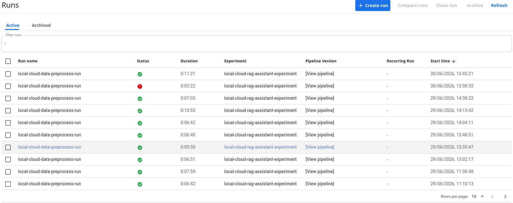
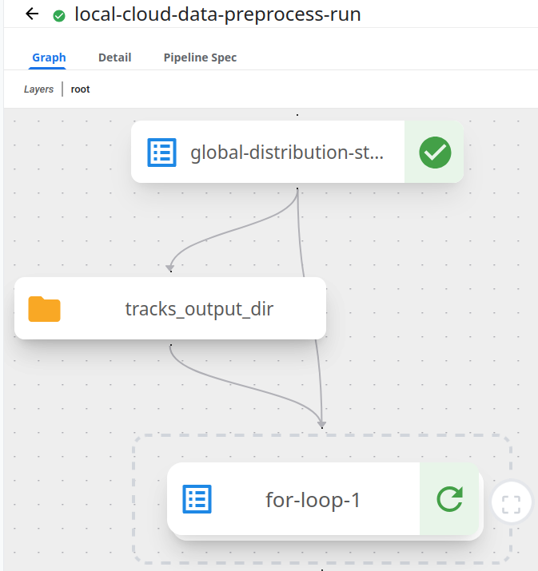
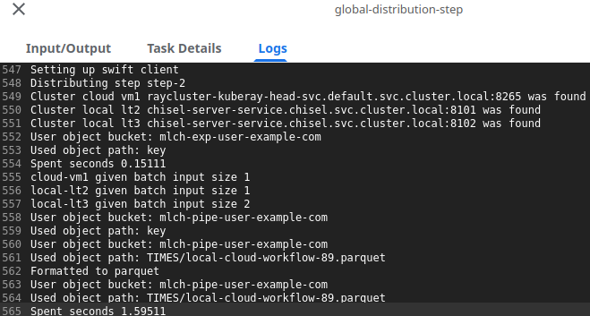
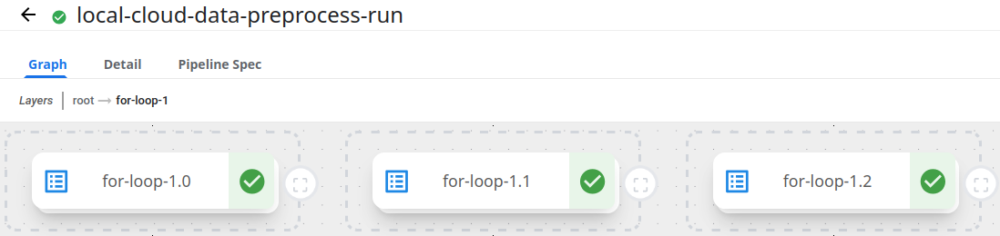
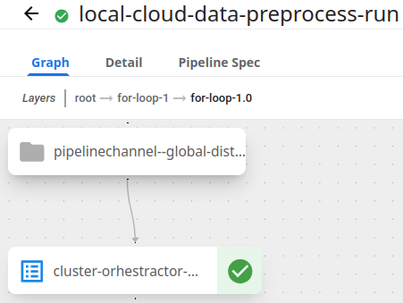

# Kubeflow Pipelines

## Used material

1. <span id="used-material-1"></span> [Kubeflow pip package](https://pypi.org/project/kfp/)

2. <span id="used-material-2"></span> [Kubeflow docs](https://www.kubeflow.org/docs/)

3. <span id="used-material-3"></span> [Getting Started with Kubeflow: A Complete Beginner’s Guide](https://kubezilla.io/getting-started-with-kubeflow-a-complete-beginners-guide/)

4. <span id="used-material-4"></span> [Compose components into pipelines](https://www.kubeflow.org/docs/components/pipelines/user-guides/components/compose-components-into-pipelines/)

5. <span id="used-material-5"></span> [Create, use, pass, and track ML artifacts](https://www.kubeflow.org/docs/components/pipelines/user-guides/data-handling/artifacts/)

6. <span id="used-material-6"></span> [Control Flow](https://www.kubeflow.org/docs/components/pipelines/user-guides/core-functions/control-flow/)

## Why use Kubeflow Pipelines?

Kubeflow Pipelines (KFP) is widely used for the following reasons:

- Provides an orchestration tool with integrated ML metadata tracking that is supported by many cloud providers, with some providing KFP SDK-managed cloud services (mature)

- Easy-to-use Pythonic SDK that decouples the execution environment from the pipeline definition, with the steps of that pipeline run as isolated containers (abstracted)

- Widely supports various frameworks and infrastructure due to containerization, with Kubernetes-provided plugins for customization that enable the creation of end-to-end MLOps pipelines (interoperable)

These features make KFP the default pipeline platform for creating MLOps workflow pipelines that can be shared and utilize provided functions to handle orchestration that managed multiple Ray clusters running in local, cloud and HPC enviroments. 

## How to use Kubeflow Pipelines?

Assuming you set up the OSS MLOps platform using the OSS chapter and the network with the Istio chapter, you can start using KFP right away by opening http://kubeflow.oss:7001. In the dashboard, click Runs to see the list of pipeline runs. This will most likely be empty, which is why you should check the example picture below:



Here, if you click one of the runs, you should get the following example pipeline graph:



If you click a pipeline step, you should see a side view with options, input/output, task details, and logs. Be aware that during runs, these will take time to appear. From these options, input/output is useful for double-checking the given arguments, while logs enable you to see what happened during the run, such as the one seen in the example picture below:



If you click root from the layers above the view and click the zoom button on the right side of for-loop-1, you'll get to see how many clusters were managed as seen in the following picture:



If you click root from the layers above the view and click the zoom button on the right side of for-loop-1, you'll get to see how many clusters were managed, as seen in the following picture:



With this, we can now monitor the progress of various pipelines and get their logs for later use. The pipelines shown in the images, which we will use later, are included in the example [Py file](./pipelines/cluster_pipeline.py). The code consists of the following steps |[(1)](#used-material-1), [(2)](#used-material-2), [(3)](#used-material-3), [(4)](#used-material-4), [(5)](#used-material-5), [(6)](#used-material-6)|:

1. Cluster_setup_step
    - Activates local, cloud, and HPC Ray clusters

2. global_distribution_step
    - Divides the object paths between available clusters, puts them into a KFP output directory artifact and creates a namedtuple for the output keys
    
3. cluster_orchestrator_step
    - Uses the track key to load the output from directory artifact, downloads the Ray script and sends it to the target Ray cluster with parameters

These steps enable us to create the following pipeline code:

```
@dsl.pipeline(
    name = "cluster-pipeline",
    description = "cluster pipeline"
)
def cluster_pipeline(
    storage: dict,
    integration: dict,
    processing: dict
):
    
    cluster_setup_task = cluster_setup_step(
        storage = storage,
        integration = integration
    )
    
    global_distribution_task = global_distribution_step(
        storage = storage,
        integration = integration,
        processing = processing
    ).after(cluster_setup_task)
    
    with dsl.ParallelFor(global_distribution_task.outputs['track_keys']) as track_id:
        current_task = cluster_orhestractor_step(
            storage = storage,
            integration = integration,
            processing = processing,
            tracks_input_dir = global_distribution_task.outputs['tracks_output_dir'],
            track_id = track_id
        )
```

The key components in this pipeline are .after() to ensure sequential step processing, an output directory artifact to store divided inputs, a namedtuple to enable ParallelFor to create cluster steps, and using the output directory artifact with the track id to load the correct input paths.

With this, we have a generalized pipeline code we can use with small edits to activate Ray clusters, run the Ray scripts we define in the steps of a pipeline dictionary, and shut down Ray clusters. The pipeline code can be submitted in a Jupyter notebook in the following way:

```
import kfp
KFP_ENDPOINT = "http://kubeflow.oss:7001"
kfp_client = kfp.Client(host=KFP_ENDPOINT)
---
%run ice-mlops-mlch/tutorials/studying/part-6/pipelines/cluster_pipeline.py
---
from icebreaker.kubeflow.use import kubeflow_manage_run
data_analysis_pipeline_time = kubeflow_manage_run(
    storage_client = workflow_swift_client,
    kfp_client = kfp_client,
    pipeline_function = cluster_pipeline,
    run_name = pipeline_run_name,
    experiment_name = pipeline_experiment_name,
    pipeline_arguments = cluster_pipeline_arguments,
    cache_steps = False,
    time_update_object = time_object_name_update,
    loop_amount = 20000,
    loop_wait = 10
)
```

Together, these pieces enable Jupyter Notebooks to collect pipeline inputs, load the pipeline function, submit the pipeline to OSS MLOps platform, and interact with the resulting pipeline artifacts. The user themself can monitor the progress by checking available available dashboards,. We will provide such a demonstration later.

---