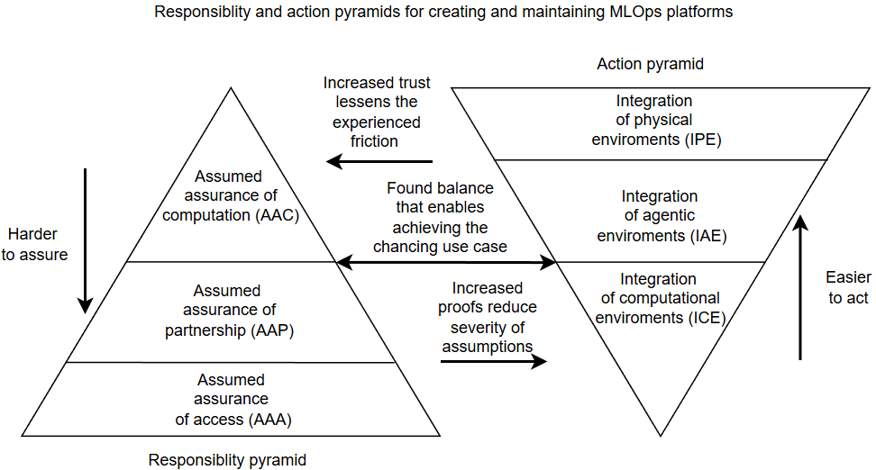

# MLOps maturity

## Used material

1.  [An empirical guide to MLOps adoption: Framework, maturity model and taxonomy](https://www.sciencedirect.com/science/article/pii/S0950584925000643)

2.  [Academic discipline](https://en.wikipedia.org/wiki/Academic_discipline#Multidisciplinary)

3.  [Interdisciplinarity](https://en.wikipedia.org/wiki/Interdisciplinarity)

4.  [Gemini Enterprise Agent Platform](https://cloud.google.com/products/gemini-enterprise-agent-platform?gclsrc=aw.ds&gad_source=1&gad_campaignid=23814814788&gclid=EAIaIQobChMIs_CV0eHvlgMV3wGiAx3_byuSEAAYASAAEgJA_vD_BwE)

5.  [Cybernetics](https://en.wikipedia.org/wiki/Cybernetics)

6.  [Variety (cybernetics)](https://en.wikipedia.org/wiki/Variety_(cybernetics))

7.  [The purpose of a system is what it does](https://en.wikipedia.org/wiki/The_purpose_of_a_system_is_what_it_does)

## What is MLOps maturity?

When we select or design MLOps platforms for a use case, we need to consider the platform's ability to evolve through iterative development to match a specific level of MLOps maturity. We can think of MLOps maturity through a framework with five stages and five dimensions [(1)](#used-material-1):

- Stages
    - Ad hoc 
        - Fragmented data, model, deployment, operations & infrastructure, and organization dimensions
        - No regulatory compliance or operational excellence
        - MLOps use and design for a use case begins here
        - Example use case: experimentation with open source ML tools
    - DataOps
        - Standardized processes for data and organisation dimensions 
        - No regulatory complience or operational excellence
        - Tools and collaboration are established here
        - Example use case: data analysis of research group data
    - Manual MLOps
        - Standardized processes for model, deployment, and operations & infrastructure dimensions
        - Can achieve regulatory complience, but not operational excellence
        - Models, inference and compute are establised here
        - Example use case: evaluation of models using open-source data
    - Automated MLOps
        - Full automation of data, model, deployment, operations & infrastructure and organization dimensions
        - Can achieve operational excellence, but not regulatory complience
        - Proper automation of interacting systems is established here
        - Example use case: Using ML bots to test game levels
    - Kaizen MLOps
        - Continuous improvement of data, model, deployment, operations & infrastructure and organization dimensions
        - Enables achieving regulatory compliance and operational excellence
        - Iterative processes are established here
        - Example use case: Automated analysis of medical images

With this framework, we can consider the maturity that our specific use case requires and how it could evolve in the future. This is especially useful when designing and implementing an MLOps platform that aims to reduce friction as it is incrementally developed for various use cases.

## How to use MLOps maturity?

We can use MLOps maturity to balance our assumptions about the world with the friction we are willing to overcome to set up an MLOps platform for our use case. The incremental adoption of MLOps is often multidisciplinary [(2)](#used-material-2) and, depending on the use case, interdisciplinary [(3)](#used-material-3). This means developers need to establish the attribute trade-offs when using or designing MLOps platforms.

A common way this assumptions vs. friction problem shows up is in choosing between the attributes of commercial vs. open-source MLOps platforms. For example, when choosing between Gemini Enterprise Agent Platform [(4)](#used-material-4) and the previously described [OSS MLOps Platform](../part-4/06_oss_mlops_platform.md), users are most likely to select the former for prepared automation and the latter for vendor independence.

In this example, users selecting the first form assume they don’t mind vendor dependence and that Google will continue supporting this service into an indeterminate future, which can backfire depending on the winds of the global political climate. Users selecting the second form make fewer assumptions but face more friction in programming and maintenance, which can also be heavily affected by similar political winds due to hardware and software dependencies. 

We can think about the assumptions and friction surrounding MLOps platforms using responsibility and action pyramids. The responsibility pyramid, built from attribute requirements, helps us consider the platform's durability, where assuring assumptions through analysis and interaction becomes harder the lower we go:

- Responsibility pyramid:
    1. Assumed assurance of computation (AAC)
        - Definition: the computation of programs run by various systems works
        - Example of working: LUMI running a Ray script sent by OSS Kubeflow Pipelines runs on cPouta
        - Example of failing: MLOps tutorials created and configured on Ubuntu not working with macOS   
    2. Assumed assurance of partnership (AAP)
        - Definition: existing collaborations work
        - Example of working: HPE and LUMI maintainers fixing filesystem slowdown causing bug in LUMI Luster
        - Example of failing: Kubeflow Pipelines developers changing the names of Docker images without users knowing
    3. Assumed assurance of access (AAA)
        - Definition: having the capability to utilize wanted resources
        - Example of working: cPouta having free NVIDIA GPUs for running a virtual machine for local-cloud-HPC integration
        - Example of failing: CSC decommissioning Puhti and Mahti to enable focus of effort on Roihu

The responsibility pyramid raises the general question of how many use-case assurances can go unfulfilled before the platform fails to achieve its purpose. Generally, you need fewer assurances when running OSS locally with simple models, and more assurances for serving public LLMs such as ChatGPT. Assurance demands and priorities also shift with stakeholder perspectives, with conflicts between developer and user interests being the most significant.

In general, developers want to provide enough features and minimize required work, while users want specific features and minimize asking for them. This shows up in user experience conflicts in MLOps platforms. The developers try to abstract away details to ensure the platform has users. The users focus on the effort needed to achieve a specific use case with the platform. 

Both sides consider various design principles of the action pyramid to ensure the most important AAC, AAP, and AAA attribute requirements. In ideal circumstances, these principles create an inverted pyramid where actions become more complicated as abstraction grows, but the real world increases effort through friction:

- Action pyramid:
    1. Integration of physical environments (IPE)
        - Problem: How to organize the interactions of various objects
        - Example solution: Physically turning on laptops and activating their controllers
        - Example friction: The developer does not know how to use or create interfaces for automation 
    2. Integration of agentic environments (IAE)
        - Problem: How to align the interests of various actors
        - Example solution: CSC leading the EuroHPC consortium to host LUMI
        - Example friction: The developer does not know how to interact with the vendor to utilize their supercomputer
    3. Integration of computational environments (ICE)
        - Problem: How to unify the programs of various systems
        - Example solution: Integrating laptops, cPouta virtual machines, Allas, Roihu, and LUMI
        - Example friction: The developer not having enough money to buy or rent computational resources

With both pyramids, we can abstract this problem using Cybernetics [(5)](#used-material-5) by viewing an MLOps platform as an Input-Output system that aims to control its own variety by reducing or adding variety [(6)](#used-material-6) in a changing world. An MLOps platform reduces variety when developers use open-source tools by trusting assurances, and increases variety when developers implement components by proving integration.

This means MLOps platform choices are never final, as changes in the use case can break assumptions and increase integration friction. The balancing act between trusting and proving can lead to the following conundrums:

- The more you trust, the less you experience friction created by other work unrelated to the use case, but you increase the severity of assumptions
    - Example: HPE updating a Bash log-cleaning script that accidentally deletes 77TB of Kyoto University research data
- The more you prove, the more you do additional work created by friction unrelated to the use case, but you increase the understanding of available solutions 
    - Example: Creating a local-cloud-HPC integration MLOps platform that can utilize the CSC ecosystem

This balancing act gets harder as the complexity, necessity, and specialty of the use case grow, given the world's complexity and the developer's finite resources. For example, gathering GPS data from reindeers for processing only requires sensors, databases, servers, and applications, while serving a chatbot for millions of people requires economic and even political power. With this, we can create the following diagram:  

A useful heuristic for checking whether an MLOps platform achieves this balance is to use 'The purpose of a system is what it does' (POSIWID) [(7)](#used-material-7). If an MLOps platform consistently fails to enable the desired use case, it is too imbalanced to achieve its purpose.  

These considerations reinforce the need for maturity, interoperability, and abstraction described in the [ICE chapter](../part-1/02_ice.md), because they enable the exploration of the necessary trust and proofs needed to create hardware-, software-, and vendor-agnostic ML workflows and products. We will use MLOps maturity and the balance between trust and proofs for platform evalution later. 

---