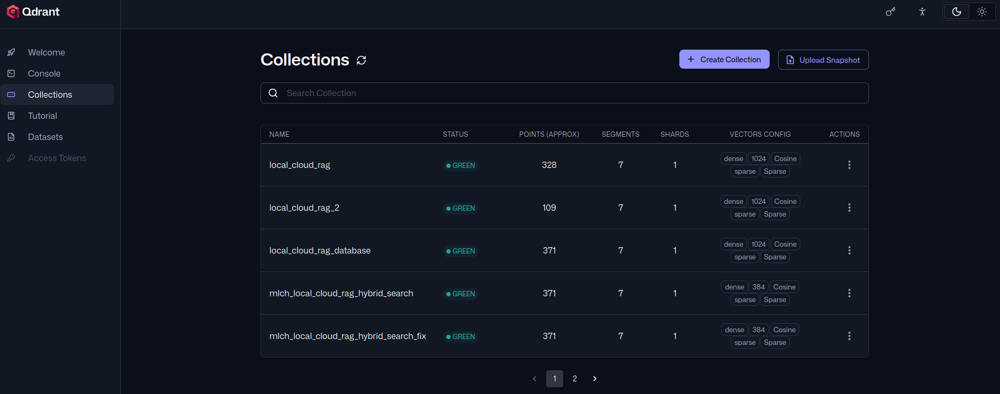
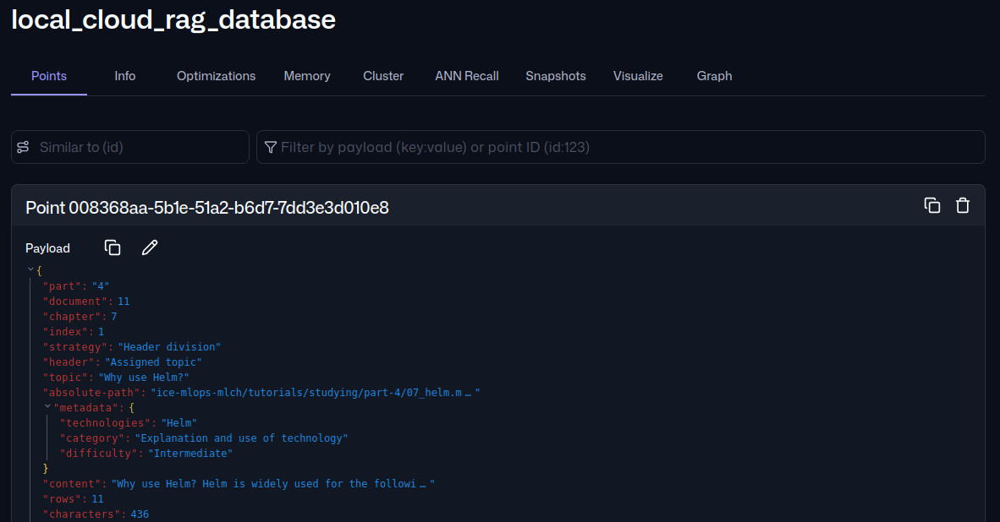
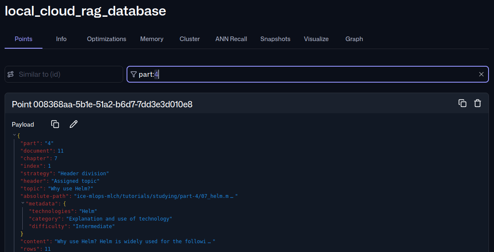
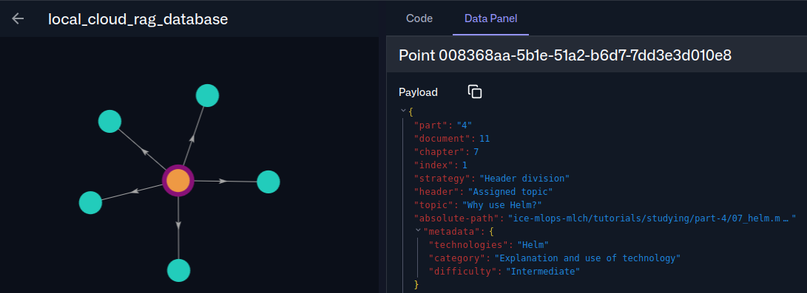
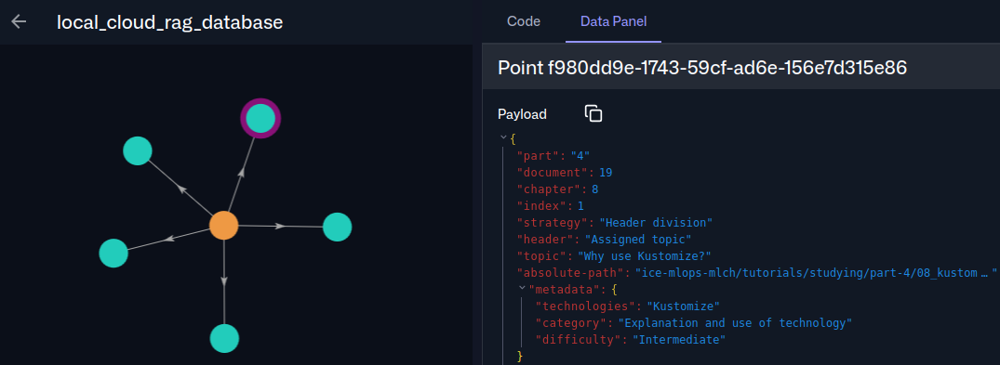
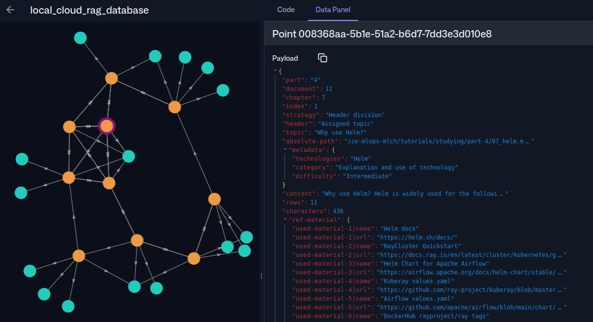

# Qdrant

## Used material

1. <span id="used-material-1"></span> [Hierarchical navigable small world](https://en.wikipedia.org/wiki/Hierarchical_navigable_small_world)

2. <span id="used-material-2"></span> [Qdrant docs](https://qdrant.tech/documentation/)

3. <span id="used-material-3"></span> [Qdrant client pip package](https://pypi.org/project/qdrant-client/)

4. <span id="used-material-4"></span> [How to Generate Sparse Vectors with SPLADE](https://qdrant.tech/documentation/fastembed/fastembed-splade/)

5. <span id="used-material-5"></span> [Demo: Implementing a Hybrid Search System](https://qdrant.tech/course/essentials/day-3/hybrid-search-demo/)

6. <span id="used-material-6"></span> [Project: Building a Hybrid Search Engine](https://qdrant.tech/course/essentials/day-3/pitstop-project/)

7. <span id="used-material-7"></span> [Hybrid and Multi-Stage Queries](https://qdrant.tech/documentation/search/hybrid-queries/)

8. <span id="used-material-8"></span> [BAAI/bge-m3](https://huggingface.co/BAAI/bge-m3)

9. <span id="used-material-9"></span> [prithivida/Splade_PP_en_v1](https://huggingface.co/prithivida/Splade_PP_en_v1)

## Why use Qdrant?

Qdrant is widely used for the following reasons:

- Provides a low-latency Rust core for a vector database with single-binary operation and payload indexing (mature)

- Easy-to-use multi-embedding vector points with natively supported hybrid search and flexible payload filtering (abstracted)

- Widely supported by many tools, exposes dual protocol APIs of gRPC and REST, and enables dynamic tenant isolation (interoperable)

These features make Qdrant the default vector database for retrieval-augmented generation. We will use its hybrid search to add context text to LLM prompts and provide accurate, up-to-date tutorial material. 

## How to use Qdrant?

Assuming you setup the OSS MLOps platform using the [OSS chapter](../part-4/06_oss_mlops_platform.md) and the network with the [Istio chapter](../part-4/11_istio.md), you can start using Qdrant right away by opening http://qdrant.oss:7001/dashboard. In the dashboard, select the key icon on the right and enter qdrant_key to set the API key. It will most likely be empty, which is why you should check the example picture below:



Here, if you click one of the collections, you should get the following example menu:



This shows a list of vector points with their payloads. You can use this list to debug payloads with search and view vector points with graphs. For example, we can check all the points created from the part 4 chunks with the following:



We can check a points similarity to other points by checking their graphs by scrolling down the point list and clicking open graph to get the following:



The graph shown is a hierarchical navigable small-world index graph [(1)](#used-material-1), where dots are individual points and edges are bidirectional links representing dots that are exceptionally close to each other in high-dimensional space. This means that you can double-check whether the used vectors make sense based on the topic shown in the payload. Compare the previous topic title against the one below:



Based on comparing titles like 'Why use Helm?' and 'Why use Kustomize?', the similarity makes sense because both are Kubernetes configuration tools that use YAML. We can confirm this further by checking other points, which have topics such as 'Why use Kubernetes?', 'Why use Docker?', 'Why use Kubernetes in Docker?' and 'Why use Docker Compose'.

These titles show that the vector embedding model can create strong connections between similar payloads. This is further confirmed by clicking the dots to reveal their connections with 'Why use Kubernetes in Docker', 'How to use Kubernetes in Docker?', 'How to use Kubernetes?', 'Imporant parts of Kubernetes', 'Important parts of Kustomize' and 'Why use Kustomize?' creating a looped graph into 'Why use helm?' as shown below:



With this, we can start using Qdrant with a Python client to create collections and add points with dense and sparse vector embeddings containing relevant chunk data |[(2)](#used-material-2), [(3)](#used-material-3), [(4)](#used-material-4), [(5)](#used-material-5), [(6)](#used-material-6), [(7)](#used-material-7)|. As described in the [LLM application development chapter](./04_llm_application_development.md), we will create a hybrid DBSF search using BAAI/bge-m3 [(8)](#used-material-8) for the dense model and prithivida/Splade_PP_en_v1 [(9)](#used-material-9) for the sparse model. We need to complete the following steps:

1. Create a client and a collection

```
from icebreaker.qdrant.setup import qdrant_setup_client
from icebreaker.qdrant.use import qdrant_create_collection
from qdrant_client.models import models

hybrid_search_config = {
    'vectors-config': {
        "dense": models.VectorParams(size=1024, distance=models.Distance.COSINE)
    },
    'sparse-vectors-config': {
        "sparse": models.SparseVectorParams(modifier=models.Modifier.IDF)
    }
}

qdrant_client = qdrant_setup_client(
    qdrant_parameters = {
        'address': 'localhost',
        'port': '7006',
        'api-key': 'qdrant_key'
    }
)

collection_name = 'local_cloud_rag_database'
status = qdrant_create_collection(
    qdrant_client = work_qdrant_client, 
    collection_name = qdrant_collection_name,
    configuration = hybrid_search_config 
)
```

2. Generate dense and sparse vectors for the chunk

```
from sentence_transformers import SentenceTransformer
from fastembed import SparseTextEmbedding
from icebreaker.embeddings.use import embeddings_batch_create_vectors

dense_model_name = "BAAI/bge-m3"
sparse_model_name = "prithivida/Splade_PP_en_v1"
dense_cache_path = Path.cwd() / 'sentence_transformers_cache'
sparse_cache_path = Path.cwd() / 'fastembed_cache'

dense_model = SentenceTransformer(
    dense_model_name,
    cache_folder = str(dense_cache_path)
)

sparse_model = SparseTextEmbedding(
    model_name = sparse_model_name,
    cache_dir = str(sparse_cache_path)
)

pandas_df = data_object[0]
df_records = pandas_df.to_dict('records')
dataset_records_map[data_index] = df_records

total_rows = len(pandas_df)
calclated_chunk = int(total_rows * 0.05)
chunk_size = max(1, calclated_chunk)
dense_vectors_list = []
sparse_vectors_list = []
row_indices = []
batch_list = []
for i in range(0, total_rows, chunk_size):
    df_chunk = pandas_df.iloc[i : i + chunk_size]
        text_chunk = df_chunk[text_column].tolist()
    df_chunk = pandas_df.iloc[i : i + chunk_size]

    chunk_row_indices = list(range(i, i + len(df_chunk)))

    dense_vectors, sparse_vectors = embeddings_batch_create_vectors(
        text_input_batch = text_input_batch,
        dense_model = dense_model,
        sparse_model = sparse_model,
        batch_size = 32
    )
    dense_vectors_list.append(dense_vectors)
    sparse_vectors_list.append(sparse_vectors)
    row_indices.append(chunk_row_indices)
    batch_list.append(i)
```

3. Create and upload vector points

```
hybrid_points = []
for batch_dataset_index in batch_list:
    source_records = dataset_records_map[batch_dataset_index]
    for idx_in_chunk, actual_row_idx in enumerate(row_indices):
        d_vec = dense_vectors[idx_in_chunk] if dense_vectors is not None else None
        s_vec = sparse_vectors[idx_in_chunk] if sparse_vectors is not None else None

        # Fetch exact correct row payload matching this vector
        dataset_row = source_records[actual_row_idx]

        # Fixed index alignment bugs via actual_row_idx
        point_uuid = embeddings_generate_uuid(
            id = dataset_name,
            index = actual_row_idx
        )

        created_point = qdrant_create_point(
            point_uuid = point_uuid,
            point_dense_vector = {"dense": d_vec} if d_vec else None,
            point_sparse_vector = {"sparse": s_vec} if s_vec else None,
            point_payload = dataset_row
        )
        hybrid_points.append(created_point)

status = qdrant_upload_points(
    qdrant_client = qdrant_client, 
    collection_name = collection_name,
    points = hybrid_points
) 
```

When all the material has been put into the collection, we can query it with the following code:

```
from icebreaker.search.use import search_monitored_batch_query

query_results = search_monitored_batch_query(
    qdrant_client = qdrant_client,
    query_type = 'hybrid-dbsf', 
    collection_name = collection_name,
    text_query_batch = [
        'What is python?'
    ], 
    relevant_weights_batch = [],
    relevance_threshold = 2.0,
    query_limit = 5,
    fusion_limit = 20,
    dense_model_name = dense_model_name,
    dense_model = dense_model,
    sparse_model_name = sparse_model_name,
    sparse_model = sparse_model,
    batch_size = 8
)
```

The output is a list of 5 points with payloads containing chunk data and query metrics; the former needs further processing before it can be used in an LLM prompt. This lets us put the parsed material into a vector database, which we can then query with hybrid search to enable retrieval augmentation, which we'll cover in more detail later.

---
