# MLflow

## Used material

1. <span id="used-material-1"></span> [MLflow pip package](https://pypi.org/project/mlflow/)

2. <span id="used-material-2"></span> [MLflow Python API Client](https://mlflow.org/docs/latest/api_reference/python_api/mlflow.client.html)

3. <span id="used-material-3"></span> [boto3 pip package](https://pypi.org/project/boto3/)

4. <span id="used-material-4"></span> [botocore pip package](https://pypi.org/project/botocore/)

## Why use MLflow?

MLflow is widely used for the following reasons:

- Provides an industry-standard framework for lineage and governance that supports both MLOps and LLMOps (mature)

- Easy-to-use model abstraction with a unified tracing API and prompt versioning and management (abstracted)

- Widely supported by many ML and LLM tools, has AI gateway integration, and is backend-agnostic (interoperable)

These features make MLflow the default logging and lineage platform for our local-cloud-HPC platform. We will use it to log our workflow artifacts, enable data analysis, and gather traces for our LLM application.

## How to use MLflow?

Assuming you've set up the platform with the [OSS chapter](../part-4/06_oss_mlops_platform.md) and the network with the [Istio chapter](../part-4/11_istio.md), we can start configuring MLflow for our use case. The MLflow version running on the OSS platform is likely a bit old, so we need to update its image to use the latest package [(1)](#used-material-1). Unlike other images, we need to build a new image with the following steps:

1. Go to the repository MLflow images

```
cd ice-mlops-mlch/docker/mlflow
```

2. Check that Docker Compose or Docker Engine is running and build the image

```
docker build -t multi-local-cloud-hpc-integration:mlflow_v3.16.1 .
```

3. Update the image name to your own Docker Hub repository

```
docker tag multi-local-cloud-hpc-integration:mlflow_v3.16.1 (your_dockerhub_user)/multi-local-cloud-hpc-integration:mlflow_v3.16.1
```

4. Push the image to the repository

```
docker push (your_dockerhub_user)/multi-local-cloud-hpc-integration:mlflow_v3.16.1
```

5. Change the image name in the MLflow deployment file (row 66)

```
cd ice-mlops-mlch/deployment/mlflow/base/mlflow-deployment.yaml
```

6. Go to the VM, download the changes and apply them

```
ssh GPU-cpouta
cd ice-mlops-mlch/deployment/mlflow/env
kubectl apply -k local
```
7. Confirm the pod runs as expected by comparing the logs to the [example logs](./misc/mlflow-logs.txt)

```
kubectl get pods -n mlflow
kubectl logs mlflow-558744b5d8-crdx2 -n mlflow
```

Assuming everything is working, we can start using MLflow by opening http://mlflow.oss:7001. In the dashboard, click Model Training and Experiments to see a list of runs. This is most likely empty, which is why you should check the example picture below:

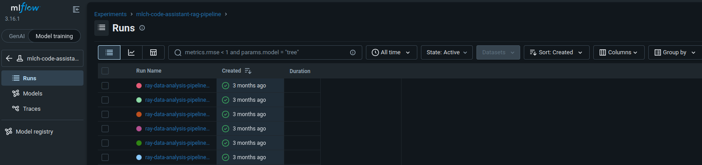

If you click one of the completed runs, you should get a list of metrics as shown in the example picture:

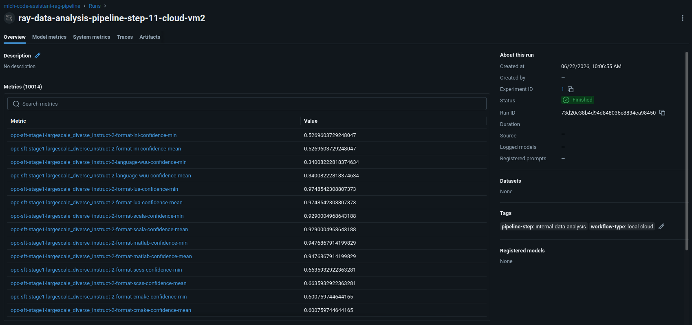

With this, we can start collecting logs and traces [(2)](#used-material-2). In a regular ML run, we can create an experiment and a run to log metrics as follows:

```
import pandas as pd
from icebreaker.mlflow.setup import mlflow_setup_client
from icebreaker.mlflow.use import mlflow_get_or_create_experiment, mlflow_start_run, mlflow_add_logs, mlflow_change_run_status
from icebreaker.misc.dict import flatten_nested_dict

mlflow_parameters = {
    'tracking-uri': 'http://mlflow.mlflow.svc.cluster.local:5000'
    's3-endpoint-url': 'http://mlflow-minio-service.mlflow.svc.cluster.local:9000'
    'aws-access-key-id': 'minioadmin',
    'aws-secret-access-key': 'minioadmin',
    'experiment-name': 'mlch-code-assistant-rag-pipeline'
    'run-name': 'part-1-8-rag-eval'
    'run-tags': {
        'workflow-type': 'local-cloud'
        'pipeline-step': 'rag-database-setup'
    }
}

mlflow_client = mlflow_setup_client(
    mlflow_parameters = mlflow_parameters
)

experiment_id = mlflow_get_or_create_experiment(
    mlflow_client = mlflow_client,
    name = mlflow_parameters['experiment-name']
)

run_id = mlflow_start_run(
    mlflow_client = mlflow_client,
    experiment_id = experiment_id, 
    run_name = mlflow_parameters['run-name'], 
    tags = mlflow_parameters['run-tags']
) 

collected_statistics = {
    'test': 0
}

parameters = {
    'query-type': 'hybrid-dbsf',
    'query-limit': 5,
}

metrics = flatten_nested_dict(
    target_dict = collected_statistics,
    parent_key = '',
    seperator = '-'
)

table = pd.DataFrame({
    "idx": [1, 2],
    "queries": [['test-1', 'test-2'], ['test-3', 'test-4']],
})

mlflow_add_logs(
    mlflow_client = mlflow_client,
    run_id = run_id, 
    parameters = parameters,
    metrics = metrics,
    metrics_prefix = 'part-1-8',
    metrics_step = 1,
    table = table,
    table_folder = 'part-1-8',
    table_name = 'ideal_rag_QA'
)

mlflow_change_run_status(
    mlflow_client = mlflow_client, 
    run_id = run_id, 
    status = 'FINISHED'
)
```

Assuming the environment  has both boto3 [(3)](#used-material-3) and botocore [(4)](#used-material-4) installed with the correct address to the MLflow MinIO and AWS credentials, there should be a finished run found in the mlch-code-assistant-rag-pipeline experiment runs list with the provided parameters, metrics, and artifacts as seen in the following pictures:

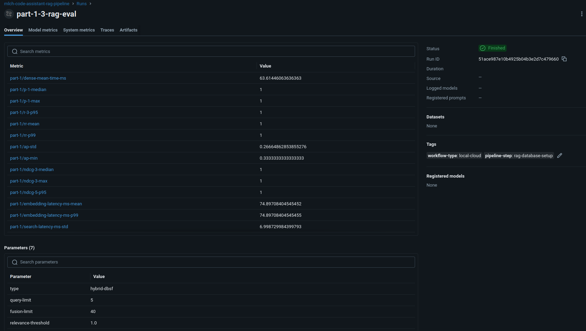

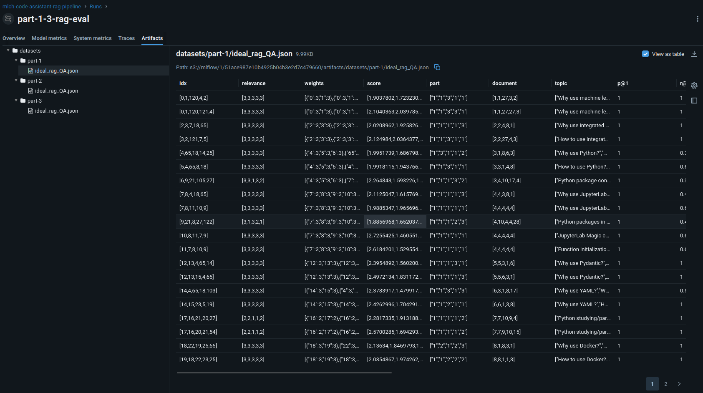

Now, go to the model metrics page to do a simple comparative analysis between collected metrics by scrolling down to Model metrics and clicking Add chart. Select a bar chart, type in the metrics you want to compare, select them from the given list of metrics, and click Add chart to create the following example bar chart:

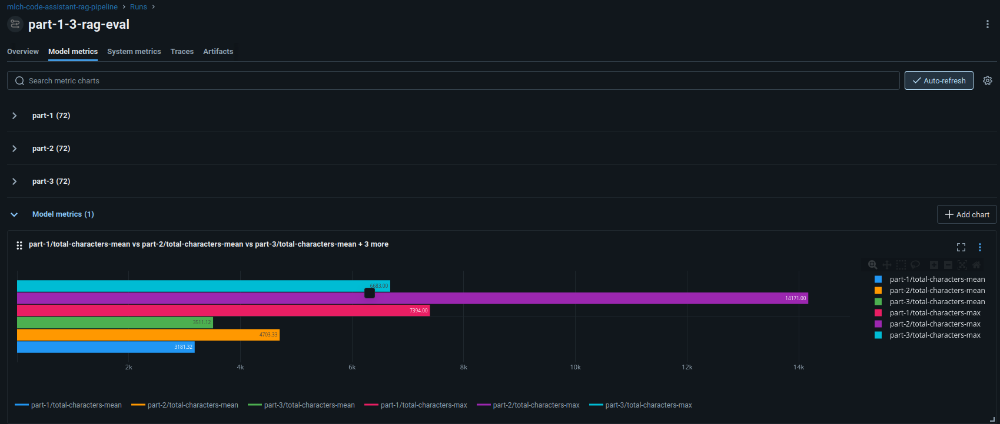

We can also compare metrics of different runs by selecting the specific runs from the given list, clicking compare above the list, and selecting compared metrics in the parallel coordinates plot to get the following:

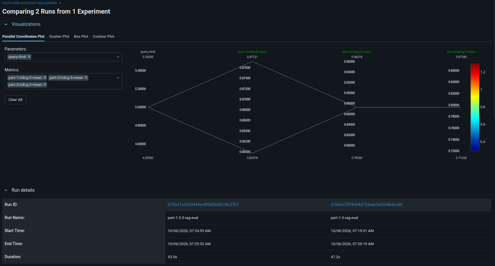

This logging approach suits metric- and output-focused cases where you don't need specific execution states for analysis. If we want to record and compare execution states of applications, such as an LLM coding assistant, we need to utilize tracing in the following way:

```
from icebreaker.mlflow.setup import mlflow_setup_client
from icebreaker.evaluation.use import evalute_add_datasets
from icebreaker.misc.yaml import get_validated_yamls
from icebreaker.mlflow.use import mlflow_register_prompts
from icebreaker.evaluation.pipe import evalution_generator_pipe

mlflow_parameters = {
    'tracking-uri': 'http://mlflow.mlflow.svc.cluster.local:5000'
    's3-endpoint-url': 'http://mlflow-minio-service.mlflow.svc.cluster.local:9000'
    'aws-access-key-id': 'minioadmin',
    'aws-secret-access-key': 'minioadmin',
    'experiment-name': 'mlch-code-assistant-rag-pipeline'
    run_name = 'part-1-8-generator-eval', 
    run_tags = {
        'workflow-type': 'local-cloud',
        'pipeline-step': 'synthetic-evalution-dataset'
    },
    'trace-name': 'data-generator-chain',
    'trace-attributes': {
        'ice.used_enviroment': 'cloud-cPouta-vm1',
        'ice.utilization_cost_sec': 0.00035,
        'ice.utilization_cost_currency': 'EUR',
        'ice.gpu_hardware_name': 'NVIDIA Tesla P100-PCIE-16GB',
        'ice.gpu_vram_mib': 16384,
        'llm.inference-framework': 'llama-cpp',
        'llm.model-repository': 'unsloth/DeepSeek-R1-Distill-Llama-8B-GGUF',
        'llm.model-quantization': 'Q4_K_M.gguf',
        'llm.context-length': 8192,
        'llm.type-k': 1,
        'llm.type-v': 1,
        'llm.n-gpu-layers': -1
    },
    'trace-tags': {
        'workflow-type': 'local-cloud'
        'pipeline-step': 'data-generation'
    }
}

mlflow_client = mlflow_setup_client(
    mlflow_parameters = mlflow_parameters
)

added_dataset_ids = evalute_add_datasets(
    swift_client = workflow_swift_client,
    mlflow_client = work_mlflow_client,
    storage_parameters = {
        'bucket-target': 'experiment',
        'bucket-prefix': 'mlch',
        'bucket-user': 'user@example.com',
        'object-serialization': 'pickle'
    },
    experiment_name = 'mlch-code-assistant-rag-pipeline',
    dataset_type = 'validation',
    dataset_paths = [
        'DATA/SOURCE/ICEbreaker-tutorial-v09-formatted-part-1.pkl',
        'DATA/SOURCE/ICEbreaker-tutorial-v09-formatted-part-2.pkl',
        'DATA/SOURCE/ICEbreaker-tutorial-v09-formatted-part-3.pkl',
        'DATA/SOURCE/ICEbreaker-tutorial-v09-formatted-part-4.pkl',
        'DATA/SOURCE/ICEbreaker-tutorial-v09-formatted-part-5.pkl',
        'DATA/SOURCE/ICEbreaker-tutorial-v09-formatted-part-6.pkl',
        'DATA/SOURCE/ICEbreaker-tutorial-v09-formatted-part-7.pkl',
        'DATA/SOURCE/ICEbreaker-tutorial-v09-formatted-part-8.pkl'
    ],
    dataset_tags = {
        'workflow-type': 'local-cloud',
        'pipeline-step': 'validation-data-setup',
    },
    dataset_user = 'user'
)

generator_prompts_yamls = get_validated_yamls(
    relative_paths = [
        '../../templates/yaml/coding-assistant-rag/prompts/model-eval-generator.yaml'
    ],
    yaml_validator = None
)

mlflow_register_prompts(
    mlflow_client = work_mlflow_client,
    prompt_yaml = generator_prompts_yamls['model-eval-generator']
)

experiment_id = mlflow_get_or_create_experiment(
    mlflow_client = mlflow_client,
    name = mlflow_parameters['experiment-name']
) 

run_id = mlflow_start_run(
    mlflow_client = mlflow_client,
    experiment_id = experiment_id, 
    run_name = mlflow_parameters['run-name'], 
    tags = mlflow_parameters['run-tags']
) 

root_span = mlflow_create_trace(
    mlflow_client = mlflow_client,  
    trace_name = trace_name,
    experiment_id = experiment_id,
    trace_attributes = trace_attributes,
    trace_tags = trace_tags,
    trace_input = trace_input
)

root_span.set_attributes({f'request.{k}': v for k, v in used_config.items()})

generator_metrics = {
    'prompt-tokens': 0,
    'completion-tokens': 0,
    'total-tokens': 0,
    'total-latency-sec': 0,
    'prompt-processing-time-sec': 0,
    'generation-time-sec': 0,
    'input-tokens-per-sec': 0,
    'output-tokens-per-sec': 0,
    'time-to-first-token-sec': 0,
    'tokens-per-second': 0,
    'time-per-output-token-sec': 0,
    'input-to-output-ratio': 0,
    'context-window-utilization-pct': 0,
}

root_span.set_attributes(
    mlflow_token_usage(
        input_tokens = generator_metrics['prompt-tokens'], 
        output_tokens = generator_metrics['completion-tokens']
    )
)

input_cost = trace_attributes['ice.utilization_cost_sec'] * generator_metrics['prompt-processing-time-sec']
output_cost = trace_attributes['ice.utilization_cost_sec'] * generator_metrics['generation-time-sec']

root_span.set_attributes(
    mlflow_llm_cost(
        model_provider = trace_attributes['llm.inference_framework'], 
        model_name = model_name, 
        input_cost = input_cost, 
        output_cost = output_cost
    )
)

root_span.set_attributes(
    mlflow_llm_effiency(
        prompt_tokens = generator_metrics['prompt-tokens'],
        completion_tokens = generator_metrics['completion-tokens'],
        total_tokens = generator_metrics['total-tokens'],
        prompt_processing_time = generator_metrics['prompt-processing-time-sec'],
        generation_time = generator_metrics['generation-time-sec'],
        input_tokens_per_sec = generator_metrics['input-tokens-per-sec'],
        output_tokens_per_sec = generator_metrics['output-tokens-per-sec'],
        total_latency = generator_metrics['total-latency-sec'],
        time_to_first_token = generator_metrics['time-to-first-token-sec'],
        tokens_per_second = generator_metrics['tokens-per-second'],
        time_per_output_token = generator_metrics['time-per-output-token-sec'],
        input_to_output_ratio = generator_metrics['input-to-output-ratio'],
        context_window_utilization = generator_metrics['context-window-utilization-pct'],
    )
)

trace_output = {
    'response': 'test'
}

mlflow_end_trace(
    mlflow_client = mlflow_client,
    trace_id = root_span.trace_id,
    trace_output = trace_output
)

parameters = trace_attributes
metrics = {
    'prompt-tokens-sum': 0,
}
table = [
    {'idx': 0, 'part': 1},
    {'idx': 1, 'part': 2}
]

mlflow_add_logs(
    mlflow_client = mlflow_client,
    run_id = run_id, 
    parameters = parameters,
    metrics = metrics,
    metrics_prefix = 'generator',
    metrics_step = 1,
    table = table,
    table_folder = 'generator',
    table_name = 'synthetic_QA_dataset'
)

mlflow_end_run(
    mlflow_client = mlflow_client, 
    run_id = run_id, 
    status = 'FINISHED',
    end_time = None
)
```

Now, if you switch to the GenAI view and click mlch-code-assistant-rag-pipeline in experiments, you should get this example overview:

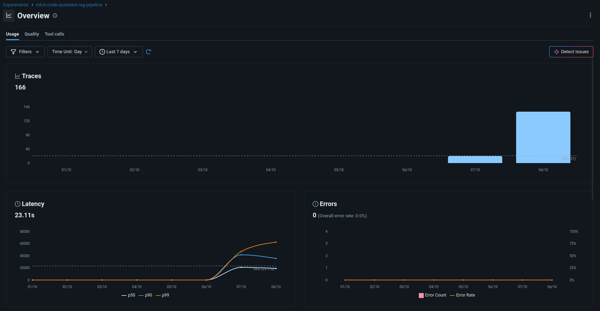

If you click either the shown bars or go to the traces page, you should see the following:

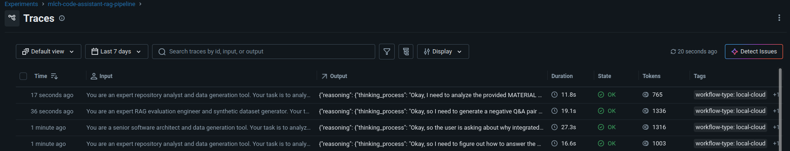

When you click one of the traces, you should get this:

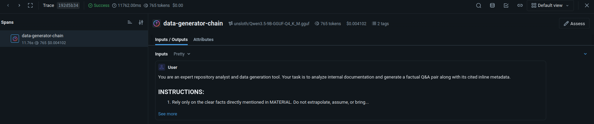

This view lets you easily debug and check the generated output for a given input and its attributes. We can further support the debugging efforts by checking the prompts page and dataset page with the following example views:

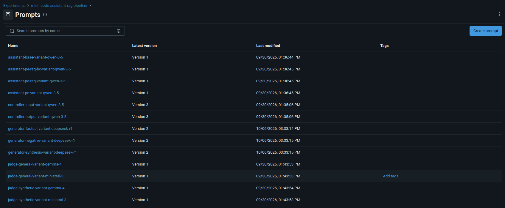

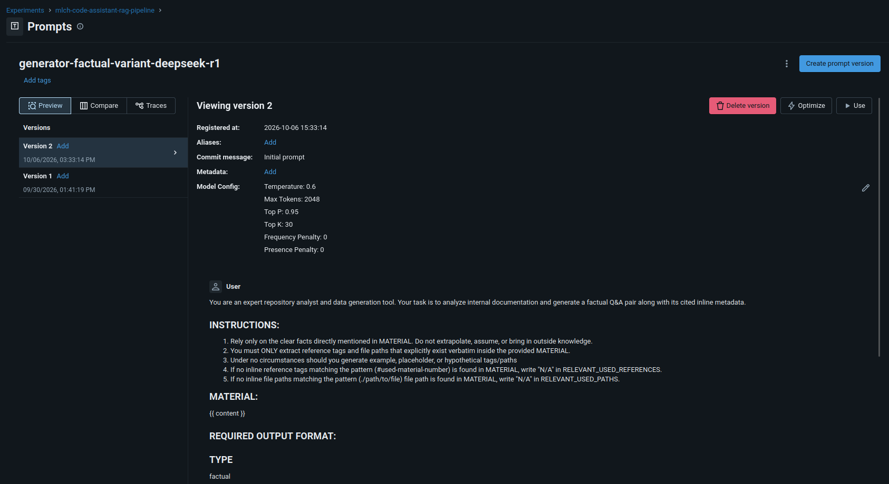

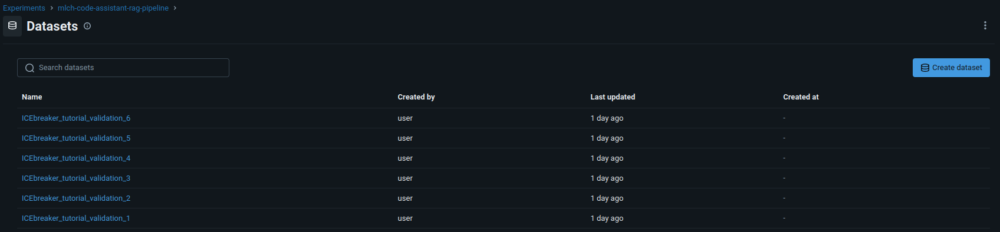

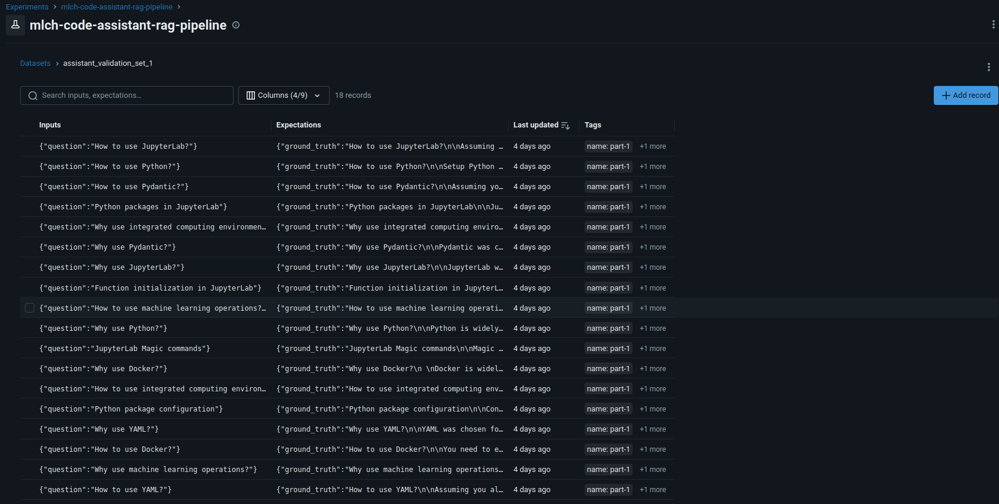

Together, these make incremental development of LLM applications easier by providing a dashboard with various tracing and analysis tools, which we can further improve by using runs to enable metric comparison across a single run or multiple runs. We will show later how to use these metrics to evaluate models and solution variants.

---